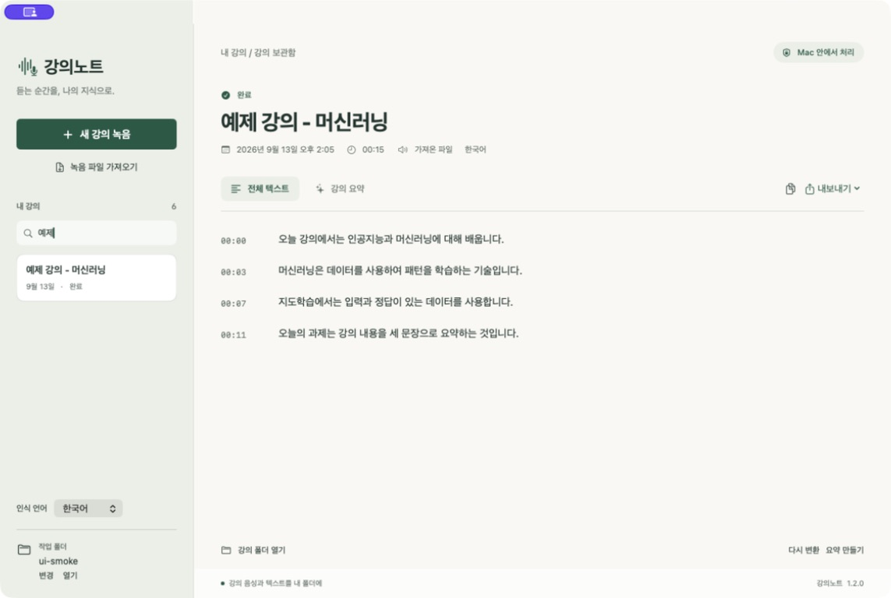
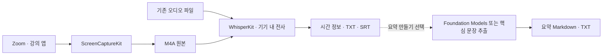

<div align="center">

# 강의노트 · LectureScribe

**강의의 소리를, 다시 읽을 수 있는 기록으로.**

Zoom 등 Mac 앱의 오디오를 직접 녹음하고, 시간 정보가 있는 텍스트를 내 폴더에 저장하는 네이티브 앱입니다.

[](https://github.com/nowjinpark/LectureScribe/actions/workflows/ci.yml)


[주요 기능](#주요-기능) · [화면 미리보기](#화면-미리보기) · [시작하기](#시작하기) · [설계 문서](docs/ARCHITECTURE.md) · [개발 가이드](docs/DEVELOPMENT.md)

</div>



<p align="center"><sub>1.2.0 설치본에서 한국어 합성 음성을 Whisper로 변환한 실제 화면입니다. 원문의 4문장과 시간 정보를 표시하며, 실제 수업이나 개인정보는 포함하지 않았습니다.</sub></p>

## 프로젝트 소개

온라인 수업을 듣고 나면 필요한 설명을 다시 찾기 위해 녹음 전체를 되돌려 들어야 합니다. **강의노트**는 Zoom 강의 소리를 직접 받아 음성 원본과 시간 정보가 있는 텍스트로 보관하기 위해 만들었습니다. 1.2.0에서는 **녹음 → 텍스트 변환 → TXT·SRT 저장**을 기본 흐름으로 정리했습니다.

수업에서 제안된 “맥용 STT 애플리케이션을 바이브 코딩으로 만들어보자”는 과제를 출발점으로, 생성형 AI와 협업해 요구사항을 네이티브 macOS 앱으로 구현했습니다. 기존 음성·언어 모델을 연결하는 데서 더 나아가 앱별 오디오 캡처, 파일 관리, 작업 중단과 복구, 메뉴 막대 사용 흐름을 구성한 포트폴리오 프로젝트입니다.

## 주요 기능

| 기능 | 동작 |
| --- | --- |
| **앱 소리 직접 녹음** | 선택한 앱의 디지털 오디오를 수집합니다. 첫 녹음 설정에서 실행 중인 Zoom을 우선 선택하며, Mac 전체 소리도 직접 선택할 수 있습니다. |
| **한국어·영어 전사** | 녹음 종료 후 Mac 안에서 Whisper 모델로 처리하고 문장과 시간 정보를 표시합니다. |
| **내 폴더에서 관리** | 강의별 음성 원본과 텍스트를 저장하고, 보관함에서 제목으로 검색합니다. |
| **가져오기·내보내기** | 기존 오디오를 가져오고 전체 텍스트 TXT와 시간 표시 자막 SRT를 저장합니다. |
| **메뉴 막대 제어** | 파형 아이콘에서 창 열기, 녹음 시작·종료, 폴더 관리를 할 수 있습니다. 창을 닫아도 작업은 유지됩니다. |
| **중단·재시도** | 저장된 원본으로 다시 처리합니다. 재전사 실패 시 이전 결과를 보존합니다. |
| **선택한 강의 요약** | 필요할 때만 **요약 만들기**를 누릅니다. Apple Intelligence 또는 핵심 문장 추출을 사용하며, 요약 없이도 녹음·전사·내보내기를 마칠 수 있습니다. |

별도 API 키가 필요하지 않습니다. [WhisperKit](https://github.com/argmaxinc/argmax-oss-swift)의 기기 내 음성 인식을 사용하며, 음성을 외부 전사·요약 API로 업로드하지 않습니다. 첫 전사 때 약 630 MB의 음성 모델과 필요한 파일을 다운로드하고 Mac에 보관해 다음 전사에서 재사용합니다.

## 화면 미리보기

상단 화면처럼 전체 텍스트와 시간 정보를 함께 확인하고 TXT 또는 SRT로 내보냅니다. 녹음 중에는 선택한 앱 이름과 입력 파형을 표시해 소리가 들어오는지 확인할 수 있습니다.

새 강의에서는 제목, 녹음할 앱, 언어만 정합니다. **실행 중인 앱 불러오기**를 누르면 검색할 수 있는 목록이 바로 열립니다. **Mac 전체 소리**에는 다른 앱과 알림 소리도 포함되므로 Zoom 강의는 Zoom을 선택합니다.

## 시작하기

**Apple Silicon Mac, macOS 26 이상, Swift 6.2 이상 및 호환 SDK**가 필요합니다. 최초 빌드의 패키지 다운로드와 첫 전사의 음성 모델 준비에는 인터넷 연결이 필요합니다. Apple Intelligence는 선택 기능인 생성 요약에만 사용합니다.

```sh
git clone https://github.com/nowjinpark/LectureScribe.git
cd LectureScribe
./scripts/build.sh
open "dist/강의노트.app"
```

기본 빌드는 로컬 실행용 임시 서명을 사용합니다. Developer ID 서명과 공증을 거친 배포본은 아닙니다. SDK와 개발 인증서 선택은 [개발 가이드](docs/DEVELOPMENT.md)를 참고하세요.

1. **작업 폴더 → 변경**에서 강의를 모아둘 위치를 선택합니다.
2. Zoom을 실행하고 **새 강의 녹음**에서 제목과 언어를 정합니다. 앱을 연 뒤 첫 녹음 설정에서는 실행 중인 Zoom이 우선 선택됩니다. 녹음 대상이 Zoom인지 확인하고, 변경하려면 **실행 중인 앱 불러오기**에서 검색·선택합니다. 앱 목록 조회에는 녹음 권한이 필요하지 않습니다.
3. 첫 녹음 시 macOS의 **개인정보 보호 및 보안 → 화면 및 시스템 오디오 녹음** 권한을 허용합니다. 허용한 뒤 **⌘Q로 완전히 종료하고 다시 열어** 녹음을 시작합니다. 영상과 마이크 입력은 저장하지 않습니다.
4. 소리가 재생될 때 입력 파형이 움직이는지 확인합니다. 수업이 끝나면 **녹음 종료하고 텍스트로 변환**을 누릅니다. 음성을 저장한 뒤 전사하고, 전체 텍스트와 TXT·SRT가 자동 저장됩니다. **내보내기**로 원하는 위치에도 저장할 수 있습니다.

녹음 전에 Zoom을 재시작했어도 같은 앱을 다시 확인해 선택을 유지합니다. 대상 앱이 없으면 시작을 막고 재선택을 안내합니다. 녹음 중 대상 앱이 종료되면 그때까지 받은 음성을 저장하며, Mac 전체 소리로 자동 전환하지 않습니다.

강의 녹음은 강사의 허용 범위에서 사용하세요. 창의 닫기 버튼은 앱을 종료하지 않습니다. 완전히 종료하려면 메뉴 막대의 **강의노트 종료**를 선택합니다.

다시 빌드한 앱에서 권한이 켜져 있는데도 녹음을 시작할 수 없다면, 임시 서명 변경으로 이전 허용이 적용되지 않을 수 있습니다. 앱을 완전히 종료한 뒤 설정 목록에서 **강의노트만 제거하고 현재 실행할 앱을 다시 추가**하세요. 응용 프로그램에 설치했다면 그 폴더의 앱을 선택합니다. 원인과 서명 설정은 [개발 가이드](docs/DEVELOPMENT.md#녹음-권한과-개발-서명)에 설명합니다.

## 설계에서 선택한 것



| 선택 | 이유와 절충점 |
| --- | --- |
| **SwiftUI 네이티브 앱** | macOS 오디오 권한, 파일 선택, 메뉴 막대를 연결합니다. 현재 macOS 전용입니다. |
| **녹음 후 변환** | 원본을 먼저 확보하고 같은 파일로 재처리합니다. 실시간 자막은 제공하지 않습니다. |
| **고정된 다국어 Whisper 모델** | 한국어 합성 음성 비교에서 기존 방식의 문장 누락을 줄였습니다. 모델 준비에 저장 공간과 시간이 들고, 실제 강의 정확도는 별도 평가가 필요합니다. |
| **긴 무음 구간 제외** | 거의 디지털 0인 긴 구간을 전사 입력에서만 제외해 무음에서 생기는 문장을 줄입니다. 원본 음성과 원래 시간 정보는 보존합니다. |
| **전사 결과 보존** | 생성 모델로 문장을 다시 쓰거나 특정 오인식 단어를 강제로 치환하지 않습니다. 음성 인식 결과와 시간 정보를 보존합니다. |
| **수동 요약** | 원문 확인 후 필요할 때만 실행합니다. 생성 요약은 강의에 없던 내용을 추가할 수 있으므로 원문과 대조해야 합니다. |
| **일반 파일로 저장** | 앱 없이도 원본과 결과를 열 수 있습니다. 여러 파일을 묶는 데이터베이스 트랜잭션은 아닙니다. |

오디오 큐, 긴 녹음의 메모리 사용 제한, 무음 처리, 취소 전달과 재전사 보존 방식은 [설계 문서](docs/ARCHITECTURE.md)에서 설명합니다.

## 검증

```sh
./scripts/test.sh                 # 서비스·저장·복구·자막 테스트
./scripts/check-audio-encoder.sh  # 합성 PCM → AAC M4A 검증
LECTURESCRIBE_ENCODER_SECONDS=3600 ./scripts/check-audio-encoder.sh
```

| 범위 | 확인한 결과 |
| --- | --- |
| 자동 테스트 | 28개 검사 통과. 오디오 읽기 경계·짧은 꼬리·48 kHz 변환·앱 식별·취소·저장·복구·자막 시간 등을 검사하며 GitHub Actions에서 실행 |
| 전사 비교 | 약 2분씩의 **한국어 합성 음성 3개**에서 Whisper 모델이 기존 기기 내 인식보다 문자 오류와 중간 누락을 줄임. [비교 방법과 수치](docs/DEVELOPMENT.md#전사-모델-비교) |
| 무음 처리 | 긴 무음이 붙은 짧은 합성 강의와 캡처본에서 원문의 4문장을 보존하고 무음에서 추가된 문장을 제거. 완전한 무음은 모델 실행 전에 제외 |
| 짧은 발화·영어 | 1초 미만 한국어 발화와 약 26초의 영어 합성 음성을 서비스로 확인. 마지막 수정 후 재검증 범위는 개발 가이드에 구분 |
| 1.2.0 설치본 | 약 15.4초 예제의 4문장 전사, TXT·SRT 자동 저장, 수동 요약 버튼, 재실행 후 기록 유지 확인 |
| Zoom 앱 캡처 | Zoom의 **스피커 테스트 소리**를 직접 캡처. 72.86초 M4A에서 약 22~38초 소리, 오디오 1트랙·영상 0트랙 확인 |
| 앱별 캡처 | QuickTime Player에서 재생한 **약 15.4초 합성 음성**을 선택 앱 소리로 캡처하고 전사·TXT 내보내기 확인 |
| 오디오 인코더 | **1시간 분량 합성 PCM**을 AAC M4A로 저장, 전체 길이·초반과 후반 소리·중간 무음 보존, 영상 트랙 없음 확인 |
| 저장과 복구 | 텍스트·자막 저장 및 재로드, TXT 내보내기, 앱 재실행 후 기록 유지 확인 |
| 요약의 한계 | 생성·저장은 동작했으나 원문에 없는 설명을 추가한 사례 확인. 자동 실행을 없애고 선택 기능으로 유지 |

전사 비교는 제한된 합성 음성의 결과이며 실제 강의의 정확도를 보장하지 않습니다. Zoom·QuickTime 캡처는 기존 설치본에서 확인했습니다. 1.2.0 설치본에서는 저장된 음성의 전사·파일 저장·재실행을 확인했으며, Zoom 녹음 시작은 앱 교체 후 기존 macOS 권한이 적용되지 않아 재허용 후 확인이 남아 있습니다.

Zoom 검사는 스피커 테스트의 디지털 소리 수집을 확인했으며, 수업 음성의 수신·전사 검증은 포함하지 않았습니다. 1시간 인코더 검사는 합성 데이터를 빠르게 공급해 파일의 시간 축을 확인한 것으로, 실제 수업을 1시간 녹음한 검사는 아닙니다.

GitHub Actions는 단위 테스트와 앱 빌드를 실행하며, 실제 모델이나 녹음 권한이 필요한 검사는 CI 범위에 포함하지 않습니다.

## 현재 범위와 다음 과제

- **실제 Zoom 수업, 장시간 실시간 캡처·전사, 배터리 사용량**은 추가 검증이 필요합니다.
- 음성 인식은 전문 용어·숫자·과제 일정 등을 틀리거나 빠뜨릴 수 있습니다. 저장된 음성과 대조해야 하며, 끝부분의 시간 정보가 있다는 사실만으로 전체 전사가 완전하다고 판단하지 않습니다.
- 무음 처리는 매우 작은 디지털 신호만 구분합니다. 배경 소음·음악·겹친 발화를 분류하는 기능은 아니며, 모든 잘못된 문장 생성을 막지는 못합니다.
- 요약은 선택 기능이며 원문에 없는 설명이 추가될 수 있습니다. 강의 원문을 대신하는 기록으로 사용하지 않습니다.
- 전사 언어는 한국어·영어 중 하나를 선택하며 **요약 출력은 한국어**입니다. 화자 구분과 별도 마이크 녹음은 제공하지 않습니다.
- 강제 종료나 전원 차단 시 완성되지 않은 M4A 파일은 복구가 보장되지 않습니다.
- 다음 검증은 실제 강의 기반 인식 정확도, Zoom 수신 음성의 보존, 긴 강의의 안정성에 집중합니다.

## 프로젝트 구성

```text
Sources/LectureScribe/     SwiftUI 화면 · 캡처 · 전사 · 요약 · 저장
Tests/LectureScribeTests/  서비스·워크스페이스 자동 테스트
Resources/                앱 정보
scripts/                  빌드 · 아이콘 생성 · 검증
docs/                     설계 · 개발 가이드 · 화면 사진
.github/workflows/        macOS 빌드·테스트
```

실제 강의 파일, 로컬 작업 폴더, 빌드 산출물, 개인 경로가 담긴 검증 보고서는 공개 저장소에서 제외했습니다.

## 참고 자료

- [Apple — ScreenCaptureKit 캡처 예제](https://developer.apple.com/documentation/screencapturekit/capturing-screen-content-in-macos)
- [Argmax — WhisperKit](https://github.com/argmaxinc/argmax-oss-swift)
- [Argmax — 사용하는 다국어 Whisper 모델](https://huggingface.co/argmaxinc/whisperkit-coreml/tree/main/openai_whisper-large-v3-v20240930_626MB)
- [Apple — Foundation Models 문맥 길이 관리](https://developer.apple.com/documentation/foundationmodels/managing-the-context-window)
- [Apple — MenuBarExtra](https://developer.apple.com/documentation/swiftui/menubarextra)
