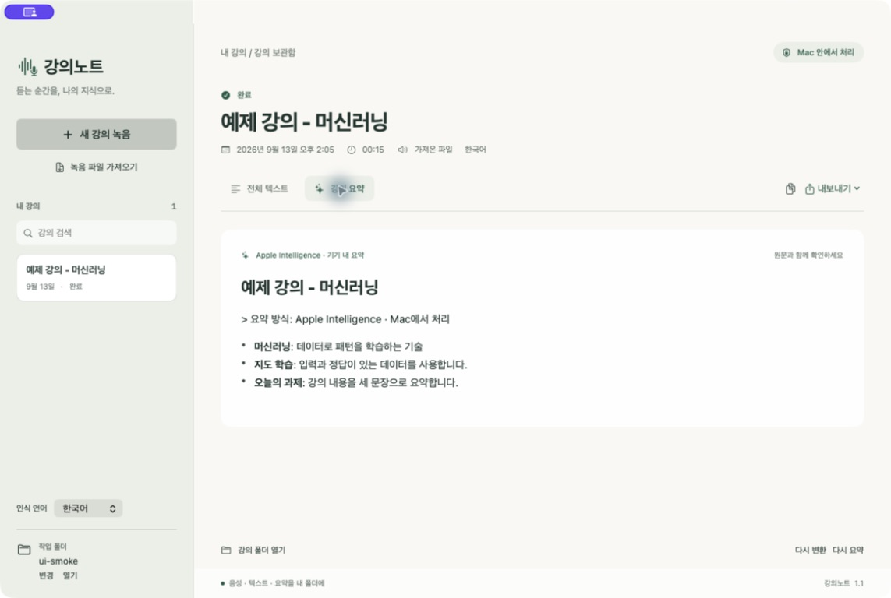
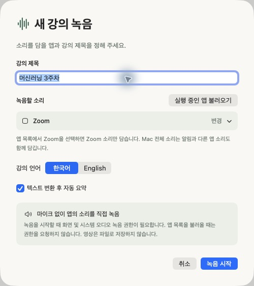
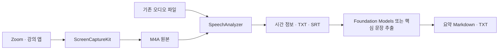

<div align="center">

# 강의노트 · LectureScribe

**강의의 소리를, 다시 읽을 수 있는 기록으로.**

Mac 앱의 오디오를 직접 녹음하고, 텍스트와 요약을 내 폴더에 저장하는 네이티브 앱입니다.

[](https://github.com/nowjinpark/LectureScribe/actions/workflows/ci.yml)


[주요 기능](#주요-기능) · [화면 미리보기](#화면-미리보기) · [시작하기](#시작하기) · [설계 문서](docs/ARCHITECTURE.md) · [개발 가이드](docs/DEVELOPMENT.md)

</div>



<p align="center"><sub>한국어 합성 음성을 앱에서 변환하고 요약한 실제 화면입니다. 실제 수업이나 개인정보는 포함하지 않았습니다.</sub></p>

## 프로젝트 소개

온라인 수업을 듣고 나면 필요한 설명을 다시 찾기 위해 녹음 전체를 되돌려 들어야 합니다. **강의노트**는 수업을 음성 원본, 시간 정보가 있는 텍스트, 복습용 요약으로 함께 보관하기 위해 만들었습니다.

수업에서 제안된 “맥용 STT 애플리케이션을 바이브 코딩으로 만들어보자”는 과제를 출발점으로, 생성형 AI와 협업해 요구사항을 네이티브 macOS 앱으로 구현했습니다. 기존 음성·언어 모델을 연결하는 데서 더 나아가 앱별 오디오 캡처, 파일 관리, 작업 중단과 복구, 메뉴 막대 사용 흐름을 구성한 포트폴리오 프로젝트입니다.

## 주요 기능

| 기능 | 동작 |
| --- | --- |
| **앱 소리 직접 녹음** | Mac 전체 또는 선택한 앱의 디지털 오디오를 수집합니다. 마이크로 스피커 소리를 다시 녹음하지 않습니다. |
| **한국어·영어 전사** | 녹음 종료 후 SpeechAnalyzer로 처리하고 확정된 문장과 시간 정보를 표시합니다. |
| **기기 내 요약** | Apple Intelligence로 한국어 요약을 생성합니다. 사용할 수 없으면 핵심 문장을 추출하고 사용한 방식을 표시합니다. |
| **내 폴더에서 관리** | 강의별 원본·텍스트·요약을 저장하고, 보관함에서 제목으로 검색합니다. |
| **가져오기·내보내기** | 기존 오디오를 가져오고 TXT, SRT, 요약 Markdown·TXT를 저장합니다. |
| **메뉴 막대 제어** | 파형 아이콘에서 창 열기, 녹음 시작·종료, 폴더 관리를 할 수 있습니다. 창을 닫아도 작업은 유지됩니다. |
| **중단·재시도** | 저장된 원본으로 다시 처리합니다. 재전사 실패 시 이전 결과를 보존합니다. |

별도 API 키와 외부 패키지 의존성이 없습니다. 음성을 외부 전사·요약 API로 업로드하는 코드는 포함하지 않았습니다. 처음 사용하는 언어 모델을 설치할 때는 인터넷 연결이 필요합니다.

## 화면 미리보기

### 시간 정보가 있는 전체 텍스트

결과와 시간 정보를 함께 확인하고 TXT 또는 SRT로 내보냅니다. 아래는 합성 예제 음성의 실제 인식 결과이며, 전문 용어의 오인식도 원문 그대로 표시됩니다.


### 녹음 설정

제목, 녹음할 앱, 언어, 자동 요약 여부를 정합니다. **Mac 전체 소리**에는 다른 앱과 알림 소리도 포함됩니다.

<p align="center"></p>

## 시작하기

**Apple Silicon Mac, macOS 26 이상, Swift 6.2 이상 및 호환 SDK**가 필요합니다. 생성 요약에는 Apple Intelligence가 필요하며, 사용할 수 없으면 핵심 문장 추출로 대체됩니다.

```sh
git clone https://github.com/nowjinpark/LectureScribe.git
cd LectureScribe
./scripts/build.sh
open "dist/강의노트.app"
```

기본 빌드는 로컬 실행용 임시 서명을 사용합니다. Developer ID 서명과 공증을 거친 배포본은 아닙니다. SDK와 개발 인증서 선택은 [개발 가이드](docs/DEVELOPMENT.md)를 참고하세요.

1. **작업 폴더 → 변경**에서 강의를 모아둘 위치를 선택합니다.
2. **새 강의 녹음**에서 제목과 언어를 정합니다. **실행 중인 앱 불러오기**를 누르면 선택 목록이 바로 열립니다. Zoom만 녹음하려면 Zoom을 실행한 뒤 목록에서 선택하세요. 앱 이름으로 검색하거나 **새로고침**할 수 있으며, 앱 목록 조회에는 녹음 권한이 필요하지 않습니다.
3. 첫 녹음 시 macOS의 **개인정보 보호 및 보안 → 화면 및 시스템 오디오 녹음** 권한을 허용합니다. 허용한 뒤 **⌘Q로 완전히 종료하고 다시 열어** 녹음을 시작합니다. 영상과 마이크 입력은 저장하지 않습니다.
4. 수업이 끝나면 **녹음 종료하고 정리하기**를 누릅니다. 전사와 요약이 순서대로 진행되며 결과가 자동 저장됩니다.

강의 녹음은 강사의 허용 범위에서 사용하세요. 창의 닫기 버튼은 앱을 종료하지 않습니다. 완전히 종료하려면 메뉴 막대의 **강의노트 종료**를 선택합니다.

다시 빌드한 앱에서 권한이 켜져 있는데도 녹음을 시작할 수 없다면, 임시 서명 변경으로 이전 허용이 적용되지 않을 수 있습니다. 앱을 완전히 종료한 뒤 설정 목록에서 **강의노트만 제거하고 현재 실행할 앱을 다시 추가**하세요. 응용 프로그램에 설치했다면 그 폴더의 앱을 선택합니다. 원인과 서명 설정은 [개발 가이드](docs/DEVELOPMENT.md#녹음-권한과-개발-서명)에 설명합니다.

## 설계에서 선택한 것



| 선택 | 이유와 절충점 |
| --- | --- |
| **SwiftUI 네이티브 앱** | macOS 오디오 권한, 파일 선택, 메뉴 막대를 연결합니다. 현재 macOS 전용입니다. |
| **녹음 후 변환** | 원본을 먼저 확보하고 같은 파일로 재처리합니다. 실시간 자막은 제공하지 않습니다. |
| **기기 내 음성·언어 모델** | API 키 없이 처리하지만 기기·OS·언어와 모델 설치 상태의 영향을 받습니다. |
| **요약 대체 방식** | 생성 모델 없이도 원문 문장을 추출하며, 생성 요약과 구분해 표시합니다. |
| **일반 파일로 저장** | 앱 없이도 원본과 결과를 열 수 있습니다. 여러 파일을 묶는 데이터베이스 트랜잭션은 아닙니다. |

오디오 큐, 마지막 전사 구간 처리, 긴 원문 분할, 취소 전달과 재전사 보존 방식은 [설계 문서](docs/ARCHITECTURE.md)에서 설명합니다.

## 검증

```sh
./scripts/test.sh                 # 요약·저장·복구·자막 테스트
./scripts/check-audio-encoder.sh  # 합성 PCM → AAC M4A 검증
```

| 범위 | 확인한 결과 |
| --- | --- |
| 자동 테스트 | **13개 통과** — Unicode 분할, 원문 기반 추출, 취소, 저장·복구, 자막 시간 등 |
| 음성 인식 통합 | **101.5초** 한국어 합성 음성을 마지막 시점까지 변환, 확정 구간 4개 |
| 생성 요약 통합 | 실제 **Apple Intelligence 기기 내 요약** 및 저장·재로드 확인 |
| 오디오 인코더 | 영상 없는 M4A 생성, 빈 녹음 처리, 기존 파일 보호 |
| 앱 UI | 가져오기 → 전사 → 요약 → TXT 내보내기 및 재실행 복구 확인 |

위 결과는 기능 검증이며 처리 속도·정확도 벤치마크가 아닙니다. GitHub Actions는 Apple Silicon macOS에서 단위 테스트와 앱 빌드를 실행합니다. 실제 음성·생성 모델이나 녹음 권한이 필요한 검증은 CI 범위에 포함하지 않습니다.

## 현재 범위와 다음 과제

- **실제 Zoom 수업 캡처, 수 시간 연속 녹음·전사, 배터리 사용량**은 추가 검증이 필요합니다.
- 인식과 요약에 오류가 있을 수 있습니다. 전문 용어, 숫자, 과제 일정은 원문과 대조해야 합니다.
- 전사 언어는 한국어·영어 중 하나를 선택하며 **요약 출력은 한국어**입니다. 화자 구분과 별도 마이크 녹음은 제공하지 않습니다.
- 강제 종료나 전원 차단 시 완성되지 않은 M4A 파일은 복구가 보장되지 않습니다.
- 향후 실제 강의 기반 정확도 평가, 긴 강의 안정성 측정, 인식 결과 편집, 배포 서명·공증을 검토할 계획입니다.

## 프로젝트 구성

```text
Sources/LectureScribe/     SwiftUI 화면 · 캡처 · 전사 · 요약 · 저장
Tests/LectureScribeTests/  요약·워크스페이스 자동 테스트
Resources/                앱 정보
scripts/                  빌드 · 아이콘 생성 · 검증
docs/                     설계 · 개발 가이드 · 화면 사진
.github/workflows/        macOS 빌드·테스트
```

실제 강의 파일, 로컬 작업 폴더, 빌드 산출물, 개인 경로가 담긴 검증 보고서는 공개 저장소에서 제외했습니다.

## 참고 자료

- [Apple — ScreenCaptureKit 캡처 예제](https://developer.apple.com/documentation/screencapturekit/capturing-screen-content-in-macos)
- [Apple — SpeechAnalyzer 소개](https://developer.apple.com/videos/play/wwdc2025/277/)
- [Apple — Foundation Models 문맥 길이 관리](https://developer.apple.com/documentation/foundationmodels/managing-the-context-window)
- [Apple — MenuBarExtra](https://developer.apple.com/documentation/swiftui/menubarextra)
