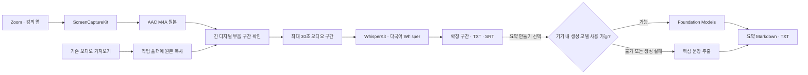

# 설계와 기술적 선택

강의노트는 Zoom 등 macOS 앱에서 재생되는 소리를 사용자가 관리하는 폴더에 저장하고, 녹음이 끝나면 시간 정보가 있는 텍스트로 변환하는 네이티브 앱입니다. 1.2.0의 기본 흐름은 음성 원본 확보, 전사, TXT·SRT 저장입니다. 요약은 사용자가 결과를 확인한 뒤 따로 실행하는 선택 기능입니다.

## 데이터 흐름

## 구성과 책임

| 구성 | 책임 |
| --- | --- |
| `ContentView` / `LectureMenuBar` | 강의 보관함, 녹음 설정, 결과 표시, 메뉴 막대 제어 |
| `AppModel` | 작업 상태, 서비스 호출 순서, 취소, 재시도, 폴더 선택 |
| `SystemAudioRecorder` | 앱별 오디오 필터, 오디오 수준 표시, M4A 인코딩 |
| `TranscriptionService` | Whisper 모델 준비·캐시, 파일 분석, 시간 정보가 있는 전사 구간 전달 |
| `AudioSpeechRegions` | 긴 디지털 무음 확인, 원본을 보존하는 전사 입력 구간 준비 |
| `WhisperAudioChunks` | 오디오 읽기량 제한, VAD 구간 분할, 짧은 마지막 구간과 원본 시간 위치 유지 |
| `SummaryService` / `LectureSummaryEngine` | 생성 요약, 문맥 분할, 핵심 문장 추출 |
| `WorkspaceStore` / `TranscriptExport` | 강의별 파일 저장·복구, TXT·SRT 생성 |

화면과 서비스 조정은 `MainActor`에서 수행합니다. 오디오 작성기의 가변 상태는 전용 직렬 큐로 제한하고, 긴 원문의 문장 점수 계산은 별도 작업에서 실행합니다.

## 1. 앱의 디지털 오디오를 직접 캡처

실행 중인 앱 목록은 `NSWorkspace.shared.runningApplications`로 조회합니다. 일반 앱 중 종료되지 않은 항목을 표시하고 강의노트 자신은 제외합니다. 이 단계에는 녹음 권한이 필요하지 않습니다. 앱 실행 후 첫 녹음 설정에서 Zoom이 실행 중이면 기본 대상으로 선택합니다.

선택한 앱은 프로세스 ID와 번들 ID를 함께 보관합니다. 녹음 시작 전에 현재 목록과 다시 대조해, 선택 뒤 재시작된 앱도 같은 번들 ID로 찾습니다. 캡처를 시작할 때는 `SCShareableContent`에서 실제 프로세스를 다시 확인합니다. 대상이 없으면 시작을 중단하고, 다른 앱이나 Mac 전체 소리로 전환하지 않습니다. 권한 허용 후 재실행과 개발 빌드의 서명에 따른 권한 문제는 [개발 가이드](DEVELOPMENT.md#녹음-권한과-개발-서명)에서 다룹니다.

`SCContentFilter`로 Mac 전체 또는 실행 중인 특정 앱을 선택합니다. `SCStream`에는 오디오 출력만 연결하고 마이크 캡처는 끕니다. 디스플레이 필터는 캡처 구성에 사용하지만 영상 트랙은 저장하지 않습니다.

이 방식은 헤드폰으로 듣는 수업을 대상으로 삼을 수 있고, 마이크로 스피커 소리를 다시 녹음할 필요가 없습니다. 대신 macOS의 화면 및 시스템 오디오 녹음 권한과 유효한 캡처 대상이 필요합니다. 본인의 마이크 발화는 별도 트랙으로 수집하지 않습니다.

오디오 작성기는 48 kHz 스테레오 입력을 128 kbps AAC M4A로 저장합니다. 첫 샘플의 타임스탬프를 기준으로 기록을 시작하며, 임시 버퍼 상한을 넘으면 실패를 알립니다. 종료 시 남은 버퍼를 처리하고 파일을 완성합니다. 이 설정값은 구현값이며 성능 측정 결과는 아닙니다.

선택한 프로세스의 종료를 감시해, 녹음 중 대상 앱이 종료되면 녹음을 멈추고 받은 음성을 저장합니다. 종료한 앱을 대신해 다른 프로세스를 자동 녹음하지 않습니다. 저장한 원본은 사용자가 텍스트로 변환할 수 있습니다.

합성 인코더 검사는 1시간 분량의 PCM을 실제 작성기로 처리하고 M4A 길이와 초반·후반 소리, 중간 무음의 위치를 확인했습니다. 이는 파일 시간 축과 인코더 검증이며 실제 Zoom 수업을 1시간 동안 캡처했다는 의미는 아닙니다.

Zoom 앱을 대상으로 스피커 테스트 소리를 직접 캡처한 검사에서는 72.86초 M4A의 약 22~38초 구간에 소리가 저장됐고, 오디오 1트랙·영상 0트랙을 확인했습니다. 발화나 원격 수업을 사용하지 않았으므로 Zoom 앱 소리 수집만 확인한 결과입니다.

## 2. 녹음 후 전사

원본 저장을 마친 뒤 전사를 실행하고 전체 텍스트를 표시합니다. 수업 중 자막 지연과 갱신을 관리하는 범위를 줄이고, 같은 원본으로 재전사할 수 있게 한 선택입니다. 요약은 자동 실행하지 않습니다. 실시간 자막은 제공하지 않으며, 장시간 실제 강의의 캡처·전사 성능은 별도 검증이 필요합니다.

음성 인식에는 공식 `argmax-oss-swift` 패키지의 **WhisperKit 1.1.0**과 다국어 **`large-v3-v20240930_626MB`** 모델을 고정해 사용합니다. 언어는 사용자가 선택한 한국어·영어를 전달하며 번역하지 않습니다. 처리 엔진을 고르는 설정이나 외부 API로 전환하는 경로는 추가하지 않았습니다. [WhisperKit 공식 저장소](https://github.com/argmaxinc/argmax-oss-swift)

기존 기기 내 음성 인식은 긴 한국어 합성 음성에서 마지막 시간 정보가 있어도 중간 문장이 빠지는 문제가 있었습니다. 같은 발화 원문과 비교해 누락·치환·삽입을 평가한 뒤 Whisper를 선택했습니다. 비교는 약 2분 분량의 합성 음성 3개로 제한되므로 실제 수업 전체의 정확도 보장은 아닙니다. 수치와 평가 방법은 [개발 가이드](DEVELOPMENT.md#전사-모델-비교)에 기록했습니다.

모델은 첫 사용 시 약 630 MB와 필요한 파일을 다운로드해 `~/Library/Application Support/LectureScribe/SpeechModels` 아래에 캐시합니다. 다음 전사에서는 내려받은 모델을 재사용합니다. 네트워크는 모델 준비에 사용하며, 녹음 파일을 외부 전사 API로 업로드하지 않습니다.

`WhisperAudioChunks`는 한 번에 최대 120초를 읽고, 분할 경계가 아직 정해지지 않은 최대 30초를 다음 읽기로 넘깁니다. WhisperKit의 공개 `VADAudioChunker(windowPadding: 0)`로 최대 30초 구간을 만들어 순서대로 인식합니다. 각 구간은 원래 녹음의 시작 위치를 유지하며, 전체 파일의 PCM을 한 번에 메모리에 올리지 않습니다. 모델과 결과 자체에도 메모리는 필요하므로 이 설정이 무제한 길이의 강의를 보장하지는 않습니다.

SDK의 기본 분할 로더에서는 1초 이하의 마지막 오디오가 빠지는 사례를 재현했습니다. 앱의 어댑터는 짧은 나머지까지 인식에 전달하고, 디코더는 일반 구간의 기본 종료 조건을 유지하면서 1초 미만 구간도 첫 인식을 시도하도록 조정합니다. 원본에 무음을 덧붙이지 않고 PCM 임시 파일도 만들지 않습니다.

Whisper는 긴 무음에서 발화하지 않은 문장을 만들 수 있습니다. `AudioSpeechRegions`는 파일을 고정 크기 버퍼로 읽어, 피크가 `1e-7` 이하인 거의 디지털 0 구간이 2초 이상 이어질 때 전사 입력을 나눕니다. 경계에 원본 오디오 0.25초의 여유를 남기고, 각 구간의 시작 위치를 결과 시간에 더해 원래 녹음의 시간 축을 유지합니다. 원본 녹음은 바꾸지 않습니다.

이 검사는 음성·소음 분류기가 아닙니다. 매우 작은 소리도 유지하도록 낮은 기준을 사용하며, 배경 소음이나 음악에서의 잘못된 인식을 모두 막지 못합니다. 서비스 검사에서 무음 포함 합성 강의와 캡처본은 원문의 4문장을 보존했고, 순수 무음은 모델 호출 전에 제외했습니다. 긴 합성 음성 3개도 전체 발화 원문과 대조했습니다. 마지막 오디오 읽기 수정 후 재검증은 48 kHz 캡처본과 네트워크 음성에 한정되며, 세부 범위는 [개발 가이드](DEVELOPMENT.md#전사-모델-비교)에 기록했습니다.

인식한 문장을 생성 모델로 다시 쓰거나 특정 오인식 단어를 강제로 치환하지 않습니다. 음성 인식이 반환한 내용과 시간 정보를 보존해 원본과 대조할 수 있게 합니다. 전문 용어와 숫자 등을 틀릴 수 있으며, 합성 음성 검사에서도 오인식이 확인됐습니다.

## 3. 선택 기능인 요약

사용자가 **요약 만들기**를 누르면 Foundation Models 사용 가능 여부와 한국어 지원을 확인한 뒤, 원문에 근거하도록 요청한 한국어 Markdown을 생성합니다. 긴 원문은 UTF-8 바이트 기준으로 나누고, 부분 요약을 다시 합칩니다. 지원되는 OS에서는 실제 토큰 수로 문맥 예산을 검사하고, 이전 버전에서는 보수적인 바이트 예산을 사용합니다.

각 요청은 새 모델 세션을 사용합니다. 반복 요약이 충분히 줄어들지 않거나 문맥 범위를 넘으면 중단하고 핵심 문장 추출로 전환합니다. 최대 반복 횟수도 제한합니다.

대체 방식은 단어 빈도와 설명 표현을 점수화하여 원문의 문장을 고릅니다. 강의 후반 주제가 빠지지 않도록 시간순 영역별 대표 문장을 선택한 뒤 원래 순서로 출력합니다. 생성 요약과 문장 추출은 화면 및 파일에 서로 다른 방식으로 표시합니다.

원문만 사용하도록 요청해도 생성 요약이 강의에 없던 설명을 추가한 사례가 확인됐습니다. 따라서 생성과 파일 저장 성공을 요약 정확도 통과로 간주하지 않습니다. 요약은 원문과 대조해야 하며, 녹음·전사 완료에는 요약 실행이나 Apple Intelligence가 필요하지 않습니다.

## 4. 저장과 작업 중단

각 강의는 날짜·시간과 UUID 일부로 만든 독립 폴더를 사용합니다. `lecture.json`에 상태·구간·요약을 보관하고, TXT·SRT·Markdown 파일은 앱 밖에서도 열 수 있게 별도로 저장합니다. 폴더 변경은 선택한 위치의 보관함을 불러오는 동작입니다.

- 개별 파일은 원자적으로 기록하며, 결과 파일을 먼저 쓴 뒤 메타데이터를 저장합니다. 폴더 전체를 한 번에 확정하는 데이터베이스 트랜잭션은 아닙니다.
- 최초 전사는 구간 도착 시 마지막 저장으로부터 10초가 지났으면 중간 결과를 저장합니다. 재전사는 새 결과가 성공하기 전까지 이전 결과를 디스크에 보존합니다.
- 취소는 모델 준비, 오디오 구간 처리, 전사와 문장 추출 작업에 전달합니다. 이미 저장된 음성과 텍스트는 보존하고 중단 상태로 기록합니다.
- 재실행 시 진행 중이던 강의는 중단 상태로 표시합니다. 일부 메타데이터가 손상되어도 다른 강의는 계속 불러옵니다.

복구는 저장된 자료를 다시 처리하는 방식입니다. 음성 인식의 내부 진행 위치에서 이어 분석하는 기능은 없습니다. 전원 차단이나 강제 종료로 완성되지 않은 M4A 파일의 복구도 보장하지 않습니다.

## 5. 메뉴 막대와 앱 수명

메인 창과 `MenuBarExtra`가 하나의 `AppModel`을 공유합니다. 창을 닫아도 작업과 메뉴 막대는 유지되고, 명시적으로 앱을 종료할 때 진행 중인 작업을 중단·저장하는 흐름을 거칩니다. 로그인 시 자동 실행은 현재 구현 범위에 포함하지 않습니다.

실행 및 검증 방법은 [개발 가이드](DEVELOPMENT.md)를 참고하세요.
