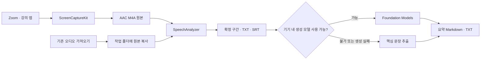

# 설계와 기술적 선택

강의노트는 macOS 앱에서 재생되는 소리를 사용자가 관리하는 폴더에 저장하고, 녹음이 끝나면 전사와 요약을 만드는 네이티브 앱입니다. Apple의 기기 내 음성 인식·요약 기능을 강의 기록 흐름에 통합하고, 캡처부터 파일 복구까지의 사용 경험을 구현했습니다.

## 데이터 흐름

## 구성과 책임

| 구성 | 책임 |
| --- | --- |
| `ContentView` / `LectureMenuBar` | 강의 보관함, 녹음 설정, 결과 표시, 메뉴 막대 제어 |
| `AppModel` | 작업 상태, 서비스 호출 순서, 취소, 재시도, 폴더 선택 |
| `SystemAudioRecorder` | 앱별 오디오 필터, 오디오 수준 표시, M4A 인코딩 |
| `TranscriptionService` | 언어 모델 준비, 파일 분석, 확정 전사 구간 전달 |
| `SummaryService` / `LectureSummaryEngine` | 생성 요약, 문맥 분할, 핵심 문장 추출 |
| `WorkspaceStore` / `TranscriptExport` | 강의별 파일 저장·복구, TXT·SRT 생성 |

화면과 서비스 조정은 `MainActor`에서 수행합니다. 오디오 작성기의 가변 상태는 전용 직렬 큐로 제한하고, 긴 원문의 문장 점수 계산은 별도 작업에서 실행합니다.

## 1. 앱의 디지털 오디오를 직접 캡처

`SCContentFilter`로 Mac 전체 또는 실행 중인 특정 앱을 선택합니다. `SCStream`에는 오디오 출력만 연결하고 마이크 캡처는 끕니다. 디스플레이 필터는 캡처 구성에 사용하지만 영상 트랙은 저장하지 않습니다.

이 방식은 헤드폰으로 듣는 수업을 대상으로 삼을 수 있고, 마이크로 스피커 소리를 다시 녹음할 필요가 없습니다. 대신 macOS의 화면 및 시스템 오디오 녹음 권한과 유효한 캡처 대상이 필요합니다. 본인의 마이크 발화는 별도 트랙으로 수집하지 않습니다.

오디오 작성기는 48 kHz 스테레오 입력을 128 kbps AAC M4A로 저장합니다. 첫 샘플의 타임스탬프를 기준으로 기록을 시작하며, 임시 버퍼 상한을 넘으면 실패를 알립니다. 종료 시 남은 버퍼를 처리하고 파일을 완성합니다. 이 설정값은 구현값이며 성능 측정 결과는 아닙니다.

## 2. 녹음 후 전사

첫 버전은 원본 저장을 마친 뒤 전사와 요약을 순서대로 실행합니다. 수업 중 자막 지연과 갱신을 관리하는 범위를 줄이고, 같은 원본으로 재전사할 수 있게 한 선택입니다. 실시간 자막은 제공하지 않으며, 수 시간 강의의 성능은 아직 별도 검증이 필요합니다.

`SpeechAnalyzer`의 파일 분석과 `SpeechTranscriber.results` 소비를 동시에 진행합니다. 파일을 모두 읽은 뒤에는 `finalizeAndFinish`를 기다려 마지막 음성까지 확정되도록 합니다. 시간 범위를 포함한 최종 결과만 보존하고, 동일 구간의 중복 결과를 걸러냅니다.

언어 지원 여부와 모델 설치 상태를 먼저 확인합니다. 모델이 없으면 Apple의 자산 설치 기능으로 준비하며, 진행률과 실패 이유를 화면에 전달합니다. 앱 코드에는 녹음을 외부 전사 API로 업로드하는 경로가 없습니다.

## 3. 생성 요약과 핵심 문장 추출

Foundation Models 사용 가능 여부와 한국어 지원을 확인한 뒤, 원문에 근거한 한국어 Markdown을 생성합니다. 긴 원문은 UTF-8 바이트 기준으로 나누고, 부분 요약을 다시 합칩니다. 지원되는 OS에서는 실제 토큰 수로 문맥 예산을 검사하고, 이전 버전에서는 보수적인 바이트 예산을 사용합니다.

각 요청은 새 모델 세션을 사용합니다. 반복 요약이 충분히 줄어들지 않거나 문맥 범위를 넘으면 중단하고 핵심 문장 추출로 전환합니다. 최대 반복 횟수도 제한합니다.

대체 방식은 단어 빈도와 설명 표현을 점수화하여 원문의 문장을 고릅니다. 강의 후반 주제가 빠지지 않도록 시간순 영역별 대표 문장을 선택한 뒤 원래 순서로 출력합니다. 생성 요약과 문장 추출은 화면 및 파일에 서로 다른 방식으로 표시합니다. 생성 결과의 사실성이나 인식 정확도를 보증하는 평가는 아직 없습니다.

## 4. 저장과 작업 중단

각 강의는 날짜·시간과 UUID 일부로 만든 독립 폴더를 사용합니다. `lecture.json`에 상태·구간·요약을 보관하고, TXT·SRT·Markdown 파일은 앱 밖에서도 열 수 있게 별도로 저장합니다. 폴더 변경은 선택한 위치의 보관함을 불러오는 동작입니다.

- 개별 파일은 원자적으로 기록하며, 결과 파일을 먼저 쓴 뒤 메타데이터를 저장합니다. 폴더 전체를 한 번에 확정하는 데이터베이스 트랜잭션은 아닙니다.
- 최초 전사는 구간 도착 시 마지막 저장으로부터 10초가 지났으면 중간 결과를 저장합니다. 재전사는 새 결과가 성공하기 전까지 이전 결과를 디스크에 보존합니다.
- 취소는 모델 다운로드, 분석기, 문장 추출 작업까지 전달합니다. 이미 저장된 음성과 텍스트는 보존하고 중단 상태로 기록합니다.
- 재실행 시 진행 중이던 강의는 중단 상태로 표시합니다. 일부 메타데이터가 손상되어도 다른 강의는 계속 불러옵니다.

복구는 저장된 자료를 다시 처리하는 방식입니다. 음성 인식의 내부 진행 위치에서 이어 분석하는 기능은 없습니다. 전원 차단이나 강제 종료로 완성되지 않은 M4A 파일의 복구도 보장하지 않습니다.

## 5. 메뉴 막대와 앱 수명

메인 창과 `MenuBarExtra`가 하나의 `AppModel`을 공유합니다. 창을 닫아도 작업과 메뉴 막대는 유지되고, 명시적으로 앱을 종료할 때 진행 중인 작업을 중단·저장하는 흐름을 거칩니다. 로그인 시 자동 실행은 현재 구현 범위에 포함하지 않습니다.

실행 및 검증 방법은 [개발 가이드](DEVELOPMENT.md)를 참고하세요.
