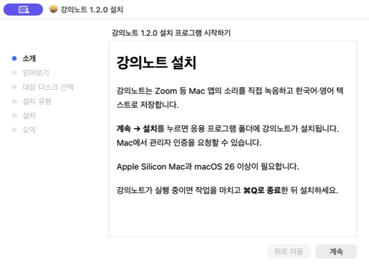

# 강의노트 설치

**[강의노트 1.2.0 설치 파일 받기](https://github.com/nowjinpark/LectureScribe/releases/download/v1.2.0/LectureScribe-1.2.0-arm64.pkg)**



Apple Silicon(M 시리즈) Mac과 macOS 26 이상을 지원합니다. Intel Mac은 지원하지 않습니다. 설치 파일은 약 1.7 MB이며, 앱 설치에 약 5.4 MB가 필요합니다. 첫 전사에서 약 630 MB의 음성 모델과 필요한 파일을 추가로 내려받습니다.

## 설치하기

1. 사용 중인 강의노트가 있으면 작업을 마치고 **⌘Q로 완전히 종료**합니다.
2. 다운로드한 `LectureScribe-1.2.0-arm64.pkg`를 더블클릭합니다.
3. 안내에 따라 **계속 → 설치**를 누릅니다. Mac이 요구하면 관리자 인증을 진행합니다.
4. **응용 프로그램 → 강의노트**를 엽니다.
5. 강의를 저장할 작업 폴더를 선택하고, Zoom을 켠 뒤 **새 강의 녹음**을 누릅니다.

앱을 폴더로 직접 옮기거나 개발 도구를 설치할 필요는 없습니다. 설치 프로그램은 `/Applications/강의노트.app`을 설치하며, 기존 강의 폴더나 음성 모델을 설치·삭제 대상으로 다루지 않습니다. 설치 후 재시동은 필요하지 않습니다.

## macOS에서 열기를 차단하는 경우

현재 공개 테스트 배포본에는 Apple Developer ID 서명과 공증이 없습니다. 따라서 다운로드한 설치 파일이나 앱에 대해 macOS가 개발자를 확인할 수 없다는 안내를 표시할 수 있습니다.

이 저장소에서 받은 파일임을 확인하고 설치하기로 결정했다면, 파일을 한 번 연 뒤 **시스템 설정 → 개인정보 보호 및 보안 → 그래도 열기**에서 해당 파일만 허용할 수 있습니다. 필요한 확인·인증은 Mac의 안내를 따르세요. 자세한 내용은 [Apple의 앱 및 설치 파일 열기 안내](https://support.apple.com/ko-kr/102445)를 참고하세요.

이는 보안 경고가 없는 배포본이 아니며, 개발자 확인 경고는 실제 검증되지 않은 소프트웨어를 설치한다는 뜻입니다. 파일이 손상되었거나 악성 소프트웨어로 식별됐다는 경고는 별개이므로 설치를 중단하고 출처를 다시 확인하세요. Gatekeeper 전체 비활성화나 보안 검사를 해제하는 명령은 필요하지 않습니다.

## 첫 녹음과 텍스트 변환

- Zoom 소리를 녹음할 때 **화면 및 시스템 오디오 녹음** 권한을 허용합니다. 허용 후 강의노트를 완전히 종료하고 다시 실행합니다.
- **녹음 종료하고 텍스트로 변환**을 누르면 원본 음성과 TXT·SRT가 작업 폴더에 저장됩니다.
- 첫 전사는 모델 다운로드·준비 때문에 더 오래 걸릴 수 있습니다. 이후 모델을 재사용하며 음성을 외부 전사 API로 업로드하지 않습니다.
- 요약은 전사 후 **요약 만들기**를 눌렀을 때만 실행합니다.

## 파일 검증과 배포 범위

[같은 릴리스의 SHA-256 파일](https://github.com/nowjinpark/LectureScribe/releases/download/v1.2.0/LectureScribe-1.2.0-SHA256SUMS.txt)로 다운로드 무결성을 확인할 수 있습니다. 두 파일을 같은 폴더에 저장한 뒤 해당 폴더에서 실행합니다.

```sh
shasum -a 256 -c LectureScribe-1.2.0-SHA256SUMS.txt
```

1.2.0 설치 패키지는 확장한 앱의 코드 서명 검사·원본 파일 비교, 설치 대상·OS·CPU 제한·재시동 필요 없음, macOS 설치 화면의 설치 직전 단계까지 확인했습니다. 패키지 검사를 위해 사용 중인 앱을 다시 설치하지는 않았습니다. 앱 자체의 Zoom 스피커 테스트 캡처와 예제 음성 전사 결과는 [개발 가이드](DEVELOPMENT.md#확인된-범위와-남은-검증)에 기록했습니다. 실제 원격 수업 전체의 인식 정확도는 별도 검증이 필요합니다.
